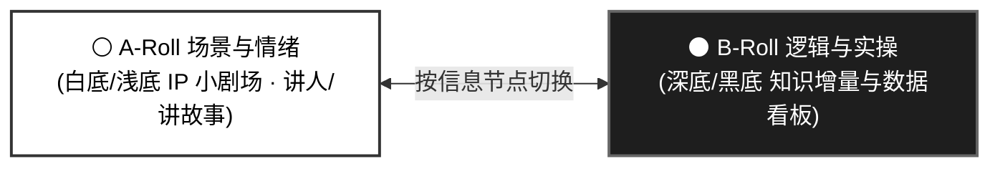

# 🎬 知识双轨教程导演手册 · A/B-Roll 工业级标准 (Knowledge A/B-Roll Director Guide)

> **版本**：v2.5（LiveCanvas + 少帧整图表演、互动与低帧数循环制作规范）  
> **所属中枢**：`handraw-video-producer` (模式：`knowledge` / `abroll`)  
> **核心原则**：A-roll 用角色动作、场景演进与情绪承接，B-roll 用实际操作与证据解释知识。先确定全片视觉方向和运动方向，再逐镜规划；按信息节点切换，10–15 秒仅为节奏起点。动效以少而明确为优先，不用单图浮动冒充角色表演，不因规范新增就宣称模板已经实现。

---

## 一、 A/B-Roll 双轨轮替模型

### 1. ⚪ A-Roll（讲人、讲情绪、讲场景 · 拒绝单一浮动动画）
- **核心职能**：人机对话感、经历阐述、情绪共鸣、章节承接、开场钩子。
- **视觉特征**：统一 IP 与可复用场景母版；浅底演播室只是可选方向，不强制每镜添加电脑、咖啡杯或浮动贴纸。
- **四种可选动作方式**：每镜选一种主方式，必要时搭配一个辅助局部动效，不要求全部叠加。整图定格序列与分层姿态切换是不同素材路线，不互相冒名替代。
  1. **整图定格序列 (Full-frame Stop-motion Sequence)**：
     - 准备两张、确有表达需要时三张完整画面；每张都包含场景、角色及相关道具，播放时全屏显示并直接切换整张图片，不把角色抠出后单独运动。不采用半屏文字说明卡替代场景表演。
     - 以第一张完整场景图作为母图，通过参考编辑得到动作变体；锁定画幅、相机、透视、静止背景、光照、身份、服装及角色比例。锁定身份不等于锁死表情或姿势；分镜指定的视线、眉眼、嘴形、头身姿态及互动对象可以协同变化，接触关系随动作正确更新。避免每张从零生成，导致无关背景、道具或身份随帧漂移。
     - 逐镜明确素材 ID、顺序和每次停留时长，可一次性 `A → B → C → 保持 C`，也可短循环 `A → B → A`。同一图片可重复引用；不因重复次数多就增加独立生成帧，不把帧数误作编码 FPS。
     - 动作帧默认硬切并保持；不在每次切帧上叠化、补间、缩放呼吸或挤压弹跳，否则会削弱定格节奏或出现双影。镜头间转场另行安排。延时按动作与台词决定，可不等长，结束保持清晰结果。
     - 例如两秒挥手片段可用 `A 0.40s → B 0.30s → A 0.40s → B 0.30s → A 0.60s`；这是可调示例，不是固定节拍。动作不是循环时不要机械往返。
     - 与分层姿态路线并列选择；用户指定“不分离整图”时保留该路线。透明角色合成后缓存成全屏 PNG 仍记录为分层姿态实现，不能作为“不分离整图变体”演示的证据。需要修复静止背景时可参考母图局部修补，但最终交付及播放资产仍是完整动作场景图。
     - 用户要求覆盖多种效果的演示片时，设计阶段列出覆盖表，给整图定格、分层登场、局部循环等已选效果各安排实际可见片段；不能因做过分层换姿势就勾选整图定格已展示。普通叙事片按内容选择，不强制包含全部方式，也不必添加动效名称说明卡。
  2. **分层定格式姿态切换 (Layered Held Pose)**：
     - 用同一背景和少量动作帧制造明确的动作变化，例如中立 → 抬手指向 → 保持结果。优先两张姿态，有必要再增加第三张；一次性动作不必循环。
     - 帧间采用清晰切换与停留，停留时长按动作可读性和台词节拍安排。不是把三张图平均分到整镜，也不是每次切换都叠化、弹跳或挤压拉伸。
     - 锁定角色身份、服装、画风、镜头、比例及接触锚点；只改变计划内的手、头、表情或道具状态。不强制角色居中，坐姿锁定座位和桌面关系，站姿锁定脚底。
     - 复用一张背景叠加透明角色动作帧；与上面的整图路线分别记录。需要角色独立遮挡、道具分层或局部锚点时选择此路线，不默认要求整图素材拆层。
     - 这是有限动画的定格观感，不等于真实逐格拍摄或连续动作生成。呼吸、缩放与相机移动只能辅助，不能代替动作帧。
  3. **空镜分层登场 (Staged Assembly)**：
     - 从已设计的空镜开始，按叙事依次出现角色、关键道具、说明标记；出现顺序应解释关系或行动，而不是无关物件的堆砌。
     - 为各层安排出现 → 到位/接触 → 稳定结果。可选直接显现、遮罩揭示、滑入或轻弹；不固定入场秒数，也不让所有元素重复同一种弹入。
     - 角色落地、手持物或桌面物件检查接触点、阴影与遮挡。到位后保持稳定，只有语义上需要的层继续运动。
  4. **低帧数局部循环 (Simple Loop)**：
     - 默认优先两帧往返 `A → B → A`；第三帧仅在两帧表达不清时使用，例如 `A → B → C → B → A`。帧数指独立动作素材数量，不是视频编码帧率；不为了“更顺滑”增加大量生成帧。
     - 一次只动一个明确局部，例如手腕轻摆、眨眼、头像轻点头或嘴边短线外扩。背景、身体主轮廓和道具保持不动，不把整张角色上下浮动当作说话。
     - 嘴边扩散线优先由渲染器绘制，不额外生图：从嘴边锚点向外扩展并减淡，回到初始状态；幅度小、线条少，留出五官与文字安全区。这是“说话示意动效”，未经音素/口型素材驱动不得称为口型同步。
     - 说话循环只在实际语音活动区间开启，停顿与结束时回到中立并保持；不能把无空缺的字幕时间轴当作无停顿口播。没有细粒度声学边界时说明按短语近似，并试听校准。
     - 循环周期与各帧停留按语速、情绪和画面可读性选择，不强制固定 FPS 或秒数。检查首尾接缝，避免空白帧、身份跳变与高频闪烁；帧少能降低复杂度，但不免除检查。
### 少帧表演：变化幅度与互动

整图定格是一种表演方法，不是挥手专用动效。可用于动作、姿势、表情变化，角色与环境/道具互动，以及角色之间的互动；按台词或情节选择，不要求每镜把这些类别全部做一遍。

- 先写清“意图/起始状态 → 行动或情绪转折 → 可见结果”，再压缩为两张、必要时三张关键画面。少的是独立素材数量，不是变化幅度；允许坐下、转身、伸手拿物、后仰等明显姿态变化，或疑惑到醒悟等表情反差。变化以缩略图下可读为准，不强制所有情绪夸张化。
- 情绪转折可联合改变视线、眉眼、嘴形、头部方向和身体重心，而非全程同一张脸只开闭嘴。先选这一拍主要情绪，再安排支持它的姿态；说话循环、汗滴、感叹线只能辅助，不能替代已经承诺的表情变化。
- 角色与环境/道具互动表现“接近/准备 → 接触或操作 → 对象变化与角色反应”，按内容合并成少数关键状态；例如从望向杯子到拿起杯子、从推门到门打开。手持物、门、座椅等是允许变化项，无关背景仍稳定。检查手物接触、遮挡、阴影及动作结果，不能只移动角色而对象毫无反馈。
- 角色与角色互动明确发起者、接收者、视线与反应时序；两三张完整画面共同更新参与角色，例如递物/接物或示意/回应。保留双方身份与空间关系，不让双方无因果地同时摇摆，不为演示互动擅自给现有故事添加配角。
- “一次只动一个局部”仅用于降低简单局部循环的复杂度，不限制整图关键姿态或互动表演。大幅变化时保持画幅、镜头和身份辨识结构，记录允许变更区域、接触点轨迹及道具状态；不要对有意变动的脸部做全像素相同验收。
- 一次性事件按因果前进并保持结果，不反复倒放“拿起/放回”或“惊讶/中立”凑时长。可重复动作才安排有限循环；停留按动作可读性、台词节拍和反馈分配，不套固定秒数。

- **稳定停留也是有效设计**：讲清结果、等待阅读或强调沉默时可静止。停止动作后保持结果，不要求每秒都动。
- **4 种镜头表达视角**：
  1. **主持人视角**：正对镜头，居中站位，胸部以上近景，眼神直视观众。用于开场钩子、章节过渡与总结陈词。
  2. **主角视角**：全景或中景，IP 角色是画面主体，在具体场景中做动作、敲键盘、互动、表现情绪。视线跟随动作，不直视镜头。
  3. **配角视角**：画面主体是新增配角，IP 角色作为旁观者或次要焦点，辅助解释场景。
  4. **第一人称视角 (POV)**：主观镜头，画面即 IP 角色眼睛看到的内容，通常看不到自身或仅看到手爪局部。用于强调“我看到了什么”或观察具体对象。

### 2. ⚫ B-Roll（讲知识、讲逻辑、展示实操与数据）
- **核心职能**：承载具体知识增量、证据事实、方案对比、操作录屏与结构拆解。
- **视觉特征**：深色/黑色背景（`#101216`），科技感与设计感兼备，聚焦内容本身。
- **4 种资产分类**：
  1. **【新增】实时动态数据看板 (LiveCanvas Data Board)**：
     - **趋势线动态划出 (Trend Sweep)**：时间序列折线沿时间轴动态展开，峰值与最新观测带发光脉冲点；
     - **多方案/模型对决 (Versus Benchmark)**：双对象并列，能力条与得分错峰增长，领先幅度自动高亮；
     - **历程推进线 (Journey Milestones)**：里程碑节点沿时间线推进点亮，弹出事件卡片；
     - **英雄量化大指标 (Hero Metric)**：关键结论大数与百分比平滑浮现，并附带精确口径与机构来源。
  2. **实操录屏型**：真实软件操作录屏、产品实操截图、后台设置特写。
  3. **信息图型 (蓝图卡片)**：步骤流、多方案横向对比、层级树状图、因果逻辑卡片（协同 handraw-style 的 `IG-*` 与 `SC-*` 图型）。
  4. **纯文字型**：金句大字卡、章节导航目录、核心结论强调。

---

## 二、 LiveCanvas 知识文案与数据核实铁律

知识类视频极易陷入“AI 味浓、满篇空话”的陷阱。吸收 LiveCanvas 的核心规范，所有台词与画面文案必须严格遵循以下铁律：

### 1. 标题与结论：直接写主体、具体数字与明确结论
- 拒绝抽象宣传与设问句，直接写事实：
  - ❌ *给长任务，更广阔的施展空间* -> ✅ **输出上限提升至 1M tokens**
  - ❌ *更强性能，更低成本，全面领跑* -> ✅ **首发任务成本低 39%**
  - ❌ *读懂三个变化，彻底颠覆认知* -> ✅ **终端任务准确率达到 57%**
  - ❌ *不确定时更愿意承认不知道* -> ✅ **幻觉率降至 15%**

### 2. 比较必须有对象、机构与口径
- 任何“领先”、“超越”、“低 X%”的结论，必须在副标题或画面底部注明来源与限定条件：
  - 例如标注：`评测来源：Artificial Analysis · 榜单日期：2026-10-01`
  - 严禁把单项测试泛化为“全面超越”；
  - 严禁为了画面好看虚构平滑峰谷，时间轴必须真实递增。

### 3. 动效克制且有目的（Emil Kowalski Animate 原则）
- **Explanation 优先**：每一个动效必须是在解释机制、比较或量化变化，不搞无意义的整屏晃动或乱飞；
- **阅读基准稳定**：标题、单位、坐标轴刻度保持绝对稳定，不跳动；
- **留足稳定阅读期**：动效在 1.5~2.0 秒内完成展开，之后必须保留至少 1.5~2.5 秒的静态完整停留帧供观众清晰阅读。

---

## 三、 导演视觉编排表规范 (Director's Shot List)

每个镜头必须明确回答 5 个核心要素：

| 镜头号 | 轨类别 | 时间区间 (对齐配音) | 视角 / 类型 | 画面主体与视觉内容 | 伴随音效 / 动效 |
| :---: | :---: | :---: | :---: | :--- | :--- |
| **01** | **A-roll** | 00:00–00:04 | 主持人视角 | 浅底，IP 面对观众引入本段问题 | 同背景两帧：中立 → 抬手；说话时嘴边短线循环，结束保持 |
| **02** | **B-roll** | 00:04–00:14 | **LiveCanvas (Versus 对决)** | 黑底，展示 Argon 与上一代模型的核心基准对决条，成本低 39% 与得分高 14% 动态展开 | 柱形生长音，高亮提示音 |
| **03** | **A-roll** | 00:14–00:20 | 主角视角 | 空工作台先出现角色，再出现与讲解有关的终端 | 各层到位后固定；两帧手部敲击，仅动作区间循环，结果保持 |
| **04** | **B-roll** | 00:20–00:30 | **LiveCanvas (Hero 指标)** | 黑底，醒目浮现 `1M tokens` 英雄指标，下附单次输出上限折线图与来源注明 | 数字上升滚动，微光扫光 |
| **05** | **A-roll** | 00:30–00:36 | 主持人视角 | 白底，IP 角色点头总结：“理性看数据，这就是本年度最重要的工程进化。” | 总结金句浮现 |

上表仅示范编排，数字、对象和结论不是可直接使用的事实素材。制作时仍需依据本期资料核实。

### A-roll 动作与素材记录

在分镜的“动效”栏或附表记录：动作方式、素材路线（完整场景图 / 背景加透明姿态 / 局部层）、语义节拍、各关键帧的姿势/表情与视线、互动主体/对象及其反馈、素材 ID、帧顺序与每次停留、开始/停止区间、最终保持状态、锁定项/允许变化项和接触/嘴部锚点。帧停留总和与循环/结果保持应覆盖镜头实际区间，不能超时或有空白。素材不足就列为待制作，不用单图呼吸替代已经承诺的姿态变化。先给出全片视觉与运动方向，再列镜头号、时间、时长、画面和动作供审；仅在用户授权执行时继续制作。

角色身份参考与动作帧用途不同：中立三视图不能充当抬手、敲击等动作帧。已有参考足够时直接复用，只补缺失动作或局部层。每个生成帧指定“保持不变 / 本帧只改变”，避免为两帧循环生成两套独立场景。

### 动态验收与实现边界

- 抽检切换前后、各姿态保持中段、循环接缝、语音开始/暂停/结束及元素到位帧；随后观看实际片段。验证动作区域确实变化，而不是只有全图位移。
- 检查背景无抖动、角色身份和尺度一致、脚底/桌面接触稳定、线条锚点随镜头变换且不遮脸。回跳到同一时刻应得到同一帧；状态由绝对时间计算，不能依赖播放次数或累积计时。
- 表演验收按分镜检查：应有情绪转折时，缩略图与实际播放中表情/姿态反差可读；有互动时，接触、对象变化、接收者反馈和最终结果成立。静止项无意漂移与计划内的大幅变化分开判断，不能把身份一致误判为表情必须不变，也不能把贴纸闪动当作角色反应。
- 整图序列预加载全部图片，按镜头局部绝对时间与累计停留边界选择唯一活动图；核对切点两侧、每张保持中段、循环接缝和最终保持，检查无双影、空白、背景跳变或额外转场。验证实际编码帧遵循素材 ID 与顺序，不只验证图片存在或只有镜头位移。
- 当前 `lib/modes/abroll_template.html` 已有 `poses` / `poseTimings` 姿态选择与预设分层道具，但仍含硬编码入场、切换挤压及全身呼吸。自定义姿态时间与冲击时间须核对一致，不能由规范推断代码已修复。
- 通用模板的 `poses` / `poseTimings` 是角色层姿态选择，不是完整场景图序列接口；也尚无本规范完整的两帧循环、语音活动门控嘴边线条和自定义空镜分层契约。整图路线需接入完整图片绘制与停留调度，不能直接将整图塞进角色层并缩放。新制作前核对实际链路，按需实现或使用已验证的期内适配器；仅写配置、加载图片或更新 skill 不算完成动画。实现后才标“已接入”，动态检查后才标“已验证”。

---

## 四、 本地极速渲染与音频标准

1. **配音语速**：
   - 知识类视频通常语速偏快、干脆利落（`+10% ~ +14%`），建议采用专业自信男声（如 `zh-CN-YunxiNeural`）或干练女声（`zh-CN-XiaoxiaoNeural`）。
2. **转场动效**：
   - A-roll 与 B-roll 之间采用 **0.25 秒平滑交叉溶解（Crossfade）或左滑推入**，节奏紧凑绝不拖沓。
3. **音效与视效对齐**：
   - 切换至 B-roll 动态数据看板时，触发重音敲击；数据条展开时带轻微扫光拟音；
   - 支持动态继承项目的 **36 款手绘主题色** 与手绘微颤描边质感。
