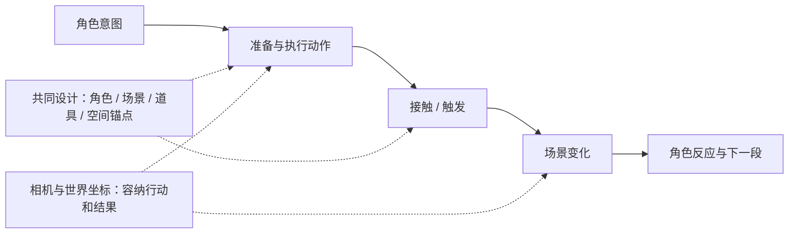

# 无界漫步长卷导演规范手册 (Unbounded Stroll Scroll Director Guide)

> **版本**：v1.3（增加知识讲解分支）  
> **适用模态**：`--mode scroll` / `wander`  
> **核心定位**：连续画卷和相机承载叙事、知识解释或景观氛围。叙事长卷以角色行动、场景变化与反应推进；知识长卷以可见过程、关系与证据解释概念，角色可选。互动、解释图层、连续动画和分层景深需要对应素材及实现，规范不等于模板能力。

---

## 1. 核心叙事模型与视觉哲学

先区分制作目的：艺术叙事沿用本节的角色因果链；知识讲解读取[知识长卷指南](scroll_knowledge_guide.md)，采用学习目标与知识解释链；景观氛围按视觉和声音体验设计。用户选择画卷讲知识时保留长卷表达，不因“知识”一词自动切到双轨教程。角色、画风数量和行走动作按解释需要选择，不设为知识片的必备项。

**无界漫步长卷（Unbounded Stroll Scroll）** 借鉴传统手卷与电影横移镜头。先确定全片视觉/运动方向，叙事制作按“主题与事件 → 角色和场景共同设计 → 动作与反馈 → 素材 → 合成”推进。每个叙事段落能说明角色想做什么、如何行动、场景因此发生什么变化、角色如何回应；跨段保留目标、状态或动作的联系。静观氛围片可以不设角色事件，但应按氛围表达验收。

### 1.1 时长、背景数量与段落

- 根据内容、视窗可见范围与实际语音分配画卷长度。短片可用一幅完整宽图；**多图制作示范至少使用两张独立生成或导入的背景**，同图裁切不算多图示范。
- 更长视频按诗句、章节、情绪或空间节点增加背景与内容，不只延长单图横移。同一视觉世界可以分卷，也可用有理由的转景；没有叙事需要时不要机械堆图。
- 长卷表现包括连续横移、阶段停留、局部推近及少量环境微动，按节奏选择。长时长不等于要匀速不停走；一张图的上下起伏也不等于真实人物行走。
- 制作前记录每段时间、预计可见区域、相邻边缘与声音锚点；合成后按实际音频更新。不要固定要求每图3–6秒或固定背景张数。
- 同一完整不透明背景只实现平面运镜。真正远/中/近景需要分离素材并验证可见运动；被背景完全遮挡的远层不计为有效视差。



### 1.2 互动分镜与导演顺序

每段先填写下表，再准备素材。表内为`design.md`中的设计记录，不是已接入CLI的配置接口。

| 字段 | 要写清的内容 |
| --- | --- |
| 段落目的 | 对主题的作用、角色意图、与上一段和下一段的联系 |
| 场景与可交互对象 | 站立/行走区域、目标物、可发生变化的部分；为何适合该动作 |
| 角色动作 | 准备 → 执行 → 接触 → 结果；必要姿态/动作帧及道具持有状态 |
| 触发时刻 | 互动开始锚点及释放、接触、响应、落地的相对时刻；有口播时映射实际语音边界 |
| 环境响应 | 被触发对象如何改变、响应出现与结束时刻、最终状态 |
| 角色反馈 | 观察、惊讶、满意、继续行动等可见反应；是否影响下一段 |
| 镜头安排 | 行进/停留/推近的时机、焦点、需完整显示的动作路径、结果阅读时间 |
| 素材与实现 | 背景、角色动作、独立道具、前景遮挡及响应层的真实来源；缺少的素材或实现单列 |

角色与场景的画风、比例、透视、光照及接触位置按[素材契约](frame_and_asset_contract.md#21-角色与场景共同设计)共同确定。环境微动服务主题；与角色无关的粒子、雾或水光不能代替因果响应。事件不要求每段同样的动作数量，停顿也可以表达观察与情绪，但其意义需可见。

事件相对互动开始定时，避免按“进段后第几秒”写死；语速或行进速度变化后，重新映射互动开始与接触/响应。相机按事件调度：进入场景、给动作留空间、完整显示结果，再继续前行。互动时可停留或让出前方空间，结果尚未显现不能提前移出；收尾阅读时间从结果呈现完成开始计算。连续前进的设计应避免非预期回拉，其他镜头运动须有明确叙事理由。

### 1.3 表现层级与素材需求

| 层级 | 可表达的内容 | 所需素材与实现 / 不能据此宣称 |
| --- | --- | --- |
| 静态姿态 | 站立、注视、一次姿态切换；可配位移或起伏 | 单张角色或少量姿态；起伏不是步态，手未变化不能视为已执行投掷 |
| 动作关键帧 | 准备、发力、接触、反应等离散阶段，有限动画 | 同一角色的对应动作帧、脚/手锚点、换帧时序及独立道具；不能宣称任意连续肢体动画 |
| 连续动画 | 连贯步态、跳跃、手臂运动等时间过程 | 足够连续帧或可执行骨骼/补间方案，验证接触、速度及阶段连续；少量姿态不能默认具备 |

背景可用本期生成的完整画作，交互物和角色采用独立素材；也可在有可用实现时用代码绘制环境与响应。按实际素材选方案，不强制全部程序化，也不直接套用参考工程的角色帧库、固定网格和像素数。模板当前能力及缺口见第5节；未接入的需求应在制作前补齐实现，或调整已授权的设计并准确说明表现层级。

### 1.4 两个完整互动设计示例

以下是v1.2加入的原始分镜范例，当时只做规范设计。相对时刻`r`均以本段互动开始为0，仅示范动作关系；实际时长按素材、配音和观看节奏确定。后续《让画回应你》按自己的动作素材和时序完成对应期内实现，实证与边界见第8节；范例仍不代表通用模板已经支持互动。

#### 示例A：水墨桥岸——投石与涟漪

- **目的与关联**：旅人在桥岸驻足，让一次小行动改变安静水面；先看见水，再投石，再观察回应，随后沿岸继续。与“行动留下回声”的主题关联。
- **场景适配**：水墨桥岸提供可站立的桥面、右前方可见水面与不遮住释放点的投掷空间。角色、石子和涟漪共用墨色/笔触；桥栏需要前景层或遮罩。脚底贴桥面，手部释放点和落水点按同一世界坐标映射。

| 阶段 / 相对时段 | 角色动作与触发 | 场景响应与角色反馈 | 镜头安排 |
| --- | --- | --- | --- |
| 准备 r=0–0.8秒 | 停步、俯身拾石、起身；石子从地面转入指定手 | 原地石子被移除，水面尚无响应 | 从跟随转为停留，桥岸、人物和目标水面同时可见 |
| 执行 r=0.8–1.4秒 | 后摆、前挥，在r=1.4秒从手部锚点释放 | 持握石子结束，独立石子沿弧线向水面运动 | 保留手和完整飞行路径，不提前切走 |
| 接触 r=1.4–2.1秒 | 石子于r=2.1秒到达落水点 | 仅在落水后出现墨色水花和扩散涟漪，石子消失于水面 | 焦点可让向落水点，角色仍能看见结果 |
| 结果 r=2.1–3.8秒 | 角色转头/俯看涟漪，随后恢复行走 | 涟漪自然衰减；角色的观察反应结束后进入下一段 | 让涟漪与反应可读，再恢复横向行进 |

- **素材/实现需求**：站立、俯身拾取、起身、挥臂、观察、行走的可用姿态或动作帧；独立石子、桥栏遮挡、水花/涟漪层；持有状态切换、路径、接触触发与相机停起。缺少挥臂帧时不能用站姿上下起伏宣称投石完成。

#### 示例B：像素世界——跳跃顶方块

- **目的与关联**：同一旅人发现悬空方块，尝试互动并获得一枚星形奖励；由发现、尝试到反馈推动段落。星形奖励落入右手，下一段保留同一手的持有状态。
- **场景适配**：平台有明确地面、可达到的方块高度及头顶活动空间；角色、方块和奖励统一像素尺度/色板，角色身份延续。方块底面、头部接触点与地面落点明确，起跳和落地阶段保持脚底锚点。

| 阶段 / 相对时段 | 角色动作与触发 | 场景响应与角色反馈 | 镜头安排 |
| --- | --- | --- | --- |
| 准备 r=0–0.5秒 | 看向方块、停步、屈膝蓄力 | 方块与奖励尚无反馈 | 停留并容纳地面、全身、方块和奖励出现空间 |
| 执行 r=0.5–1.0秒 | 蹬地、腾空，头部于r=1.0秒接触方块底面 | 脚离地；未接触时方块不震动、奖励不出现 | 跟踪起跳但不裁头和接触目标 |
| 接触 r=1.0–1.5秒 | 头部触顶后角色下降 | 方块受撞上移后回落，星形奖励从上方弹出并沿弧线落向角色右手；方块变为已触发状态 | 保留碰撞点与奖励轨迹，避免特效遮挡接触 |
| 结果 r=1.5–2.8秒 | r=1.8秒落地、缓冲，抬头伸出右手，r=2.3秒接住星形奖励 | 地面承接落地；奖励触手后从飞行层转为右手持有层，仅保留一份；角色满意后继续前行 | 结果完整显示后再继续前行，角色不穿过方块或悬空滑走 |

- **素材/实现需求**：观察、蓄力、起跳、腾空、下降、落地缓冲、右手接取与持有反应的可用动作素材；独立方块/星形奖励；跳跃与奖励轨迹、碰撞触发、方块状态、右手持有切换及前后遮挡。位移贴图不自动等于跳跃，奖励弹出也不能取代可见碰撞。

---

## 2. 视觉资产与长卷缝合规约

### 2.1 风格场景大图（Scenes）
- **长宽与画幅**：
  - 竖屏长卷（1080×1920）：适合在小红书、抖音、视频号平台形成纵向充盈、横向无尽流动的视觉冲击；
  - 横屏长卷（1920×1080）：适合在 B 站、YouTube 或展厅大屏形成史诗级宽银幕体验。
- **相邻图像的空间契约**：
  - 背景生成前统一画幅、缩放、地平线高度、远近尺度和河流/道路方向；在提示词中明确前图右边缘与后图左边缘的连续内容。
  - 接缝优先放在低细节天空、雾或水面；避免把两座不匹配的前景山、树、人物叠成重影。生成失败时修边缘或重生成，不凭滤镜宣布无缝。
  - 每张素材记录来源、原尺寸、SHA256、实际生成提示词、世界位置、缩放及裁切。示范片的两张背景要确实进入编码画面。
- **软边缘羽化融合算法（Feathered Alpha Blend）**：
  - 相邻图像在**世界坐标**中重叠，重叠宽度按输出尺寸与边缘内容选择，不能固定180–240像素适用于所有画幅；应小于两张背景的有效宽度。
  - 可用余弦/平滑阶跃透明度，按需校正高度与色调。羽化只软化边缘，不保证景物和光照连续。
  - 总宽为有效图宽之和减重叠，相机最大位置为总宽减视窗宽。背景不足时应补素材或改变构图，不虚增世界宽度露出程序底色。
  - 检查接缝进入、居中和离开视窗的帧；查看水平线跳变、双重山线、光色断裂、黑边，以及编码后是否仍清晰。

### 2.2 漫步主体（The Strolling Protagonist）

按内容选择两种视觉主体构架；叙事角色须满足第1节的事件和动作设计：

1. **时空旅人模式（Traveler Silhouette / IP Stroller）**：
   - 漫步人物按全片身份与场景设计，站立面、接触物和动作共同适配；构图可从视窗左侧约25%–30%试起，互动时让出目标空间，不固定为所有镜头要求；
   - 微小正弦起伏可作为有限动态；真正步态需要动作帧/图集或其他角色动画，不能把起伏宣称为完整行走；
2. **纯景观一镜到底模式（Pure Panorama）**：
   - 无实体人物，以景观变化和视野流动表达氛围；按真实场景/层次决定镜头运动，不把平面横移描述成已实现贴地或掠空巡航。

### 2.3 前景视差粒子系统（Ambient Particle Drift）
环境粒子按题材选择，不是必加层；使用固定种子并以绝对时间计算，保证回跳与重载一致。可选效果：
- **春/夏**：落樱花瓣、浮尘微光；
- **秋**：枫叶、枯草碎屑；
- **冬/奇幻**：白雪、星光微尘。
- 粒子可按不同于中景的速率漂移；它是环境叠层，不自动构成地形景深，也不能作为角色触发的场景响应。

---

## 3. 沿途里程碑题跋与字幕排版

### 3.1 卷轴题跋印记（Chapter Milestones）
当长卷镜头行进到新画风或核心情节时，在画面上部或侧边浮现**古典印章与长卷题跋**：
- **印章卡片**：红底白字手绘方印（如【墨韵】、【芳华】、【天工】）；
- **章节题名**：典雅宋体/手写楷体，垂直或水平排列，伴有细线展开动效；
- **停留逻辑**：可以世界锚点滑入/滑出，也可短暂屏幕题跋；检查真实实现并准确描述。旧模板题跋为屏幕定位，不能仅写配置就当成世界锚点。

### 3.2 底部极简手绘字幕条（Subtitles）
- 解说字幕依内容选择画内、独立SRT或无字幕，标题/题跋与内部音频时间线分别处理。艺术留白场景可交付可选字幕，不默认加卡条。
- 字幕边界来自实际音频，精度以服务数据为准，不声称自动逐字毫秒精确。使用目标画幅的安全区检查文字和关键画面。

---

## 4. 配乐与拟音流转规约（Audio Ambience）

无界长卷的听觉体验同样强调“无缝流动”：
- **背景音乐（BGM）**：推荐具有行走感、探索感、治愈感或时空跨越感的器乐（如古琴+钢琴交融、轻快弦乐、氛围氛围乐 Ambient）；
- **环境拟音交替（Foley Blend）**：
  - 穿行山水时：溪水潺潺、松涛阵阵、远山啼鸟；
  - 穿行雨巷时：屋檐滴雨、纸伞沙沙；
  - 穿行赛博都市时：低频电磁脉冲、全息轻微蜂鸣。

---

## 5. CLI 一键工作流与指令规约

通用CLI配音默认Edge-TTS，不因配置字段支持火山引擎。指定火山时使用可用volc-tts或期内适配器，保存实际服务成功回执，流式音频每段独立Base64解码后再拼接，按真实PCM样本数计时。五句/五幕属于当前配音技能的规约，不是长视频固定章节数。

通用CLI目前只对白板暴露sidecar/none参数；其他模式需要真实实现的期内脚本。`scroll_template.html`可直接配置`panorama:true`、`showTitle:false`、`subtitleMode:'sidecar'`或`'none'`、`particleCount:0`与`overlap`；这些不是已新增的CLI参数。当前长卷模板主要提供背景拼接、横移、单张角色的有限起伏、粒子、标题与字幕；无动作帧切换、步态、互动状态机、手部道具锚点、碰撞反馈、独立图层地形或自动空间校正。制作第1.4节的示例需按素材清单补齐期内实现，不能直接声称运行下面命令即可获得相应互动。

本次v1.2更新仅完善规范，未修改引擎或新增CLI接口；本手册第1.2节的表和[素材契约第2.1节](frame_and_asset_contract.md#21-角色与场景共同设计)的要求是设计记录与验收依据。已有`videos/episodes/2026-10-08 把时间铺成一条河/`原片定位为背景拼接与运镜示范，保留原资产、配音、配置和成片，不作为角色互动能力证据。

先完成图片/字体加载、画布与CSS/viewport/编码一致性、世界覆盖、过渡帧和逆向回跳/重载一致性，再编码成片。按需检查字幕、完整解码、帧数、音画实长与编码后响度；静帧检查与ASR不能代替动态听审。

```bash
# 1. 创建无界长卷工程
python skills/handraw-video-producer/bin/hvp.py new "漫步千年：手绘艺术长卷" --mode scroll

# 2. 生成配音与服务实际返回的时间边界
python skills/handraw-video-producer/bin/hvp.py tts "漫步千年：手绘艺术长卷"

# 3. 极速无头渲染 (Playwright 管道推流)
python skills/handraw-video-producer/bin/hvp.py render "漫步千年：手绘艺术长卷"

# 4. 混音与合成成片
python skills/handraw-video-producer/bin/hvp.py mix "漫步千年：手绘艺术长卷"

# 5. 生成 4:3 与 3:4 艺术封面
python skills/handraw-video-producer/bin/hvp.py covers "漫步千年：手绘艺术长卷"

# 6. 一键端到端全自动出片
python skills/handraw-video-producer/bin/hvp.py build "漫步千年：手绘艺术长卷"
```

## 6. 叙事互动验收

1. **语义与因果**：看见角色意图、动作、场景变化和反应；行动适合场景，响应由正确事件触发，最终状态与下一段不矛盾。
2. **接触与时序**：检查准备、执行、释放/碰撞及响应前后和结果帧；石子从手部出发，水花在落水后出现，方块/奖励在触顶后响应。调节节奏后重新检查锚点。
3. **空间与连续性**：无非预期悬空、脚滑、穿地、穿物、换手、双份道具或状态重置；真实腾空有起落过程，前景遮挡符合空间关系；跨画风保持同一身份和动作阶段。
4. **镜头与可读性**：关键接触点、运动路径、环境变化和角色反馈均进入视窗，未被题跋/字幕/特效挡住；结果呈现完成后有可读停留，再移动到下一段。
5. **运动证据**：检查角色、道具和响应层各自的阶段变化；必要时固定相机或分别看图层核对。背景横移带来的全屏帧差、粒子变化或首尾差不能单独证明角色动作和互动成立。
6. **交付证据**：保留对应时间码、帧和动态观看问题记录，区分规则完善、素材生成、接入实现、机器检查、动态审片和用户接受。静帧/ASR不足以证明动态因果自然；缺少实际实现时标记待实现，不能填“成片互动已验证”。

## 7. 参考来源与迁移边界

本规范参考本地`E:/openProject/whiteboard-video/huashu-art-motion/`的`references/10-角色.md`、`11-长卷穿越片.md`与`12-口播整片与经验回流.md`，吸收角色帧与场景画风协调、脚底锚点、走→停下互动→走、事件相对互动开始定时、结果停留和按问题审片的方法。参考目录无需作为本Skill的运行依赖。

这里保留本项目的真实生图、配音和期内适配路径；不照搬全代码背景、固定8帧、固定站立高度/步速，也不引入参考作者的个人形象或示范角色资产。最初v1.2更新仅做文档校验；后续单期测试见第8节，不据此推断通用模板能力。

v1.3另吸收该参考工程`references/09-视频动画语法.md`和`12-口播整片与经验回流.md`中的口播关键词驱动、世界画布、概念配色、单焦点解释、结果阅读与知识逻辑检查，形成[知识讲解分支](scroll_knowledge_guide.md)。参考工程的解说语法和长卷穿越是不同路线；本项目只迁移适用方法，不宣称其片段接口已接入本项目。

## 8. 三画风互动测试与实际边界

`videos/episodes/2026-10-08 让画回应你/`为后续制作的30秒、1920×1080、30fps测试片。三幅独立景观、三套12姿态图集、三套透明景深图集、木桥与三阶段花朵均由内置imagegen生成，角色为原创黑发、赭黄外套、青绿色挎包旅人；源提示词与哈希在期内`assets/generation_manifest.json`。人物是四阶段步态循环与互动关键帧的有限表演，道具和响应采用连续轨迹，不能称为任意骨骼动画。

- **期内实现**：`scene.html`和`produce.py`处理三层可见视差、绝对时间换帧、脚/手/头顶锚点、石子持有→飞行→落水、触花→花开与光纹、头顶方块→震动与已触发状态、星光飞行→手持，以及镜头停起、轻推近和跨画风边界。事件时刻属于本片，不设为通用常量。通用`scroll_template.html`尚未接入这些能力。
- **素材适配经验**：图集实际姿态可能越过等分格边界，直接按格裁切会带入邻格碎片或切掉鞋底；本片用透明连通区域定位完整人物，再记录原图采样框。统一参考站立高度，不把俯身/蹲姿都放大到同样高度。手部和脚底仍须看图校正；本片根据实际桥面与花园岸边调整地面路径，不能把透明包围盒当作自动接触验证。
- **可见层与反馈**：透明前景的裁边需要落在画框或适当羽化区域，不能在半屏留下整齐截断线；避免近景掩住接触与结尾手持物。桥面、桥前栏与角色分开合成，花朵使用匹配画风的真实素材。固定相机检查同时固定缩放，并检查响应状态与锚点，不能只看整幅像素差。
- **已完成的检查**：27组关键帧、接触前后状态与手/头锚点、固定相机响应对、反向回跳、新页面重载、14张实际载入图像、画布/CSS/viewport一致，以及成片900帧、30秒、完整解码、音频峰值。8张实际编码帧与当前场景比对通过，封面保持比例，字幕采用真实SeedASR边界。证据见期内`outputs/visual_qa.json`、`encoded_frame_qa.json`及`validation.json`。
- **验收状态**：已查看动作、接触、地面、转场和结尾静帧；技术/抽帧检查不代替完整动态观看、听审或用户审美确认。成片保留`rendered_awaiting_user_review`，原《把时间铺成一条河》不变。本期制作记录区分素材、接入、验证与能力限制。

复用时先读期内`design.md`、素材元数据与`production_record.md`。期内`produce.py`支持`tts / align / prepare / qa / render / mix / covers / build`；已生成的配音与ASR可缓存复用，重做服务需要本地火山配置。这里没有新增通用CLI参数。

## 9. 知识长卷的实现与验收边界

[知识长卷指南](scroll_knowledge_guide.md)定义分镜、解释层与验收方法，属于v1.3规范扩展。通用模板仍为第5节列出的能力；第8节单片实现可提供事件和接触组织的参考，但尚未验证知识解释、动态标签/关系图层或口播关键词驱动的通用链路。首次制作时逐项核对实现，补齐本期适配，再记录实际成片证据。不能将《让画回应你》的艺术互动检查写成知识长卷已验收。
